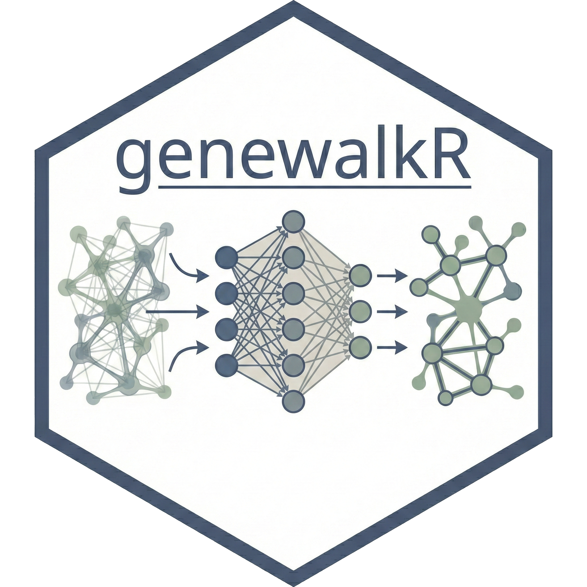

# genewalkR package

 
[](https://github.com/GregorLueg/genewalkR/actions/workflows/R-cmd-check.yml)
[](https://opensource.org/licenses/MIT)
[](https://gregorlueg.github.io/genewalkR/)



## Description

This package implements various computational biology methods that use 
[node2vec](https://arxiv.org/abs/1607.00653) under the hood. It leverages the
rextendr interface into Rust to make these methods **VERY** fast. For now, we 
have the following methods implemented:

- General node2vec to generate embeddings, please see this [vignette](https://gregorlueg.github.io/genewalkR/articles/node2vec.html).
- The GeneWalk approach from [Ietswaart et al.](https://genomebiology.biomedcentral.com/articles/10.1186/s13059-021-02264-8) (see GitHub [here](https://github.com/churchmanlab/genewalk)).
If you want to use this, please check out this [vignette](https://gregorlueg.github.io/genewalkR/articles/genewalk.html).
- A Gene context drift type approach akin to [Jassim et al.](https://www.cell.com/cancer-cell/fulltext/S1535-6108(25)00255-7). Specifically the part around running node2vec onto two
networks, followed by Procruste alignment and identifying node embeddings that
differ between the two networks. Details can be found in this 
[vignette](https://gregorlueg.github.io/genewalkR/articles/embedding_drift.html).

## Installation

You will need Rust on your system to have the package working. An installation
guide is provided [here](https://www.rust-lang.org/tools/install). There is a
bunch of further help written [here](https://extendr.github.io/rextendr/index.html)
by the rextendr guys in terms of Rust set up. (`genewalkR` uses rextendr to 
interface with Rust.)

### Setting up the Rust toolchain

Steps for installation:

1. In the terminal, install [Rust](https://www.rust-lang.org/tools/install)

```
curl --proto '=https' --tlsv1.2 -sSf https://sh.rustup.rs | sh
```

2. In R, install [rextendr](https://extendr.github.io/rextendr/index.html):

```
install.packages("rextendr")
```

3. Finally install genewalkR:

```
devtools::install_github("https://github.com/GregorLueg/genewalkR")
```

### Install genewalkR

```r
# From GitHub
remotes::install_github("GregorLueg/genewalkR")
```

## How to use the package

Please refer to the [website](https://gregorlueg.github.io/genewalkR/) of the
package to check out how to use this. Vignettes and function definitions are
provided there. If you run into issues, please use GitHub issues.

## License

Copyright (c) 2025 genewalkR authors

Permission is hereby granted, free of charge, to any person obtaining a copy
of this software and associated documentation files (the "Software"), to deal
in the Software without restriction, including without limitation the rights
to use, copy, modify, merge, publish, distribute, sublicense, and/or sell
copies of the Software, and to permit persons to whom the Software is
furnished to do so, subject to the following conditions:

The above copyright notice and this permission notice shall be included in all
copies or substantial portions of the Software.

THE SOFTWARE IS PROVIDED "AS IS", WITHOUT WARRANTY OF ANY KIND, EXPRESS OR
IMPLIED, INCLUDING BUT NOT LIMITED TO THE WARRANTIES OF MERCHANTABILITY,
FITNESS FOR A PARTICULAR PURPOSE AND NONINFRINGEMENT. IN NO EVENT SHALL THE
AUTHORS OR COPYRIGHT HOLDERS BE LIABLE FOR ANY CLAIM, DAMAGES OR OTHER
LIABILITY, WHETHER IN AN ACTION OF CONTRACT, TORT OR OTHERWISE, ARISING FROM,
OUT OF OR IN CONNECTION WITH THE SOFTWARE OR THE USE OR OTHER DEALINGS IN THE
SOFTWARE.