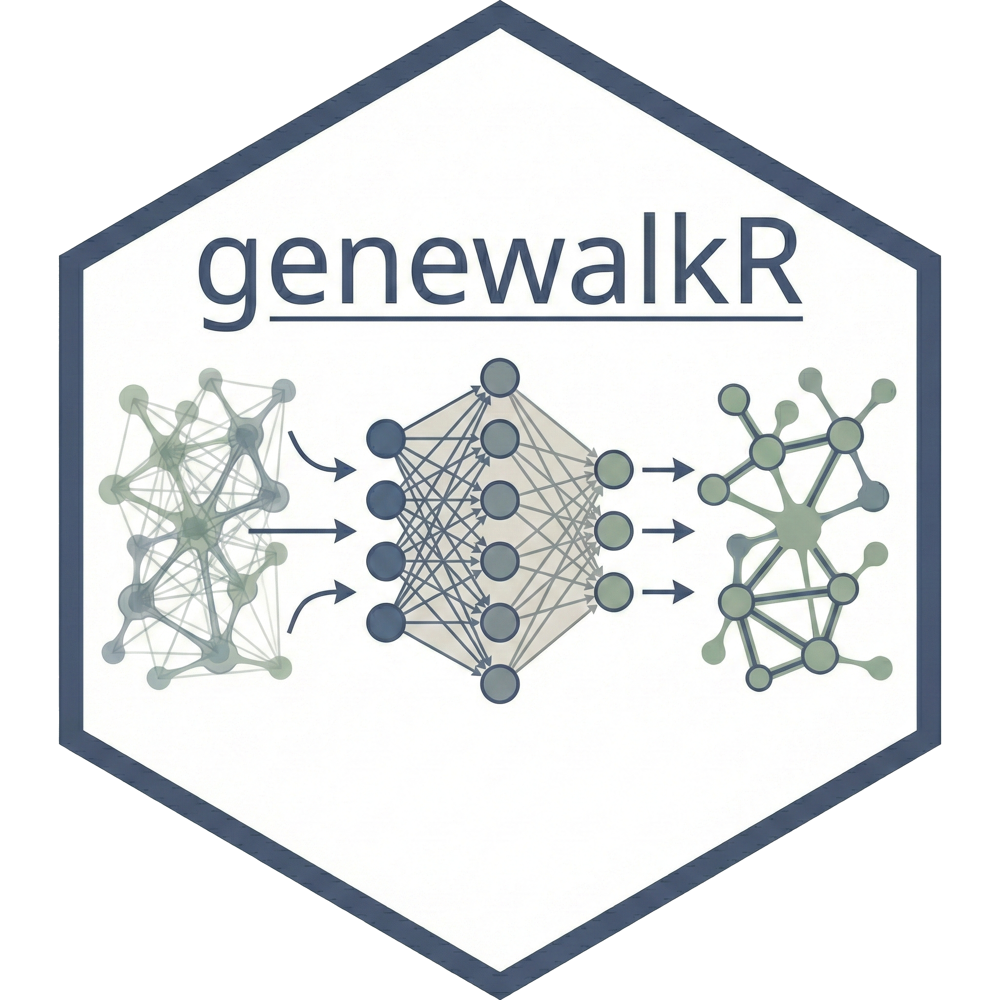

# genewalkR package

 
[](https://github.com/GregorLueg/genewalkR/actions/workflows/R-cmd-check.yml)
[](https://opensource.org/licenses/MIT)
[](https://gregorlueg.github.io/genewalkR/)



## Description

This package implements various computational biology methods based on graphs: 

- More "simple" 
  [diffusion algorithms of labels over networks](https://pmc.ncbi.nlm.nih.gov/articles/PMC5860365/) 
  that have been translated into Rust for speed and reduced memory pressure.
- Methods leveraging [node2vec](https://arxiv.org/abs/1607.00653), a small graph
  neural network. 

For now, the following methods implemented:

- Various diffusion methods for "guilty-by-association" approaches, see 
  [Tsuda et al.](https://pubmed.ncbi.nlm.nih.gov/16204126/),
  [Vandin et al.](https://pubmed.ncbi.nlm.nih.gov/21385051/), 
  [Bersanelli et al.](https://pmc.ncbi.nlm.nih.gov/articles/PMC5059623/) and
  [Mostafavi et al.](https://pmc.ncbi.nlm.nih.gov/articles/PMC2447538/).
- General node2vec to generate embeddings, please see this 
  [vignette](https://gregorlueg.github.io/genewalkR/articles/node2vec.html).
- The GeneWalk approach from 
  [Ietswaart et al.](https://genomebiology.biomedcentral.com/articles/10.1186/s13059-021-02264-8) 
  (see GitHub [here](https://github.com/churchmanlab/genewalk)).
  If you want to use this, please check out this [vignette](https://gregorlueg.github.io/genewalkR/articles/genewalk.html).
- A Gene context drift type approach akin to [Jassim et al.](https://www.cell.com/cancer-cell/fulltext/S1535-6108(25)00255-7) 
  Specifically the part of running node2vec over two networks, followed by 
  Procruste alignment and identifying node embeddings that differ between the 
  two networks, indicating a context drift for these nodes/genes. Details can be 
  found in this [vignette](https://gregorlueg.github.io/genewalkR/articles/embedding_drift.html).

## Installation

You will need Rust on your system to have the package working. An installation
guide is provided [here](https://www.rust-lang.org/tools/install). There is a
bunch of further help written [here](https://extendr.github.io/rextendr/index.html)
by the rextendr guys in terms of Rust set up. (`genewalkR` uses rextendr to 
interface with Rust.)

### Setting up the Rust toolchain

Steps for installation:

1. In the terminal, install [Rust](https://www.rust-lang.org/tools/install)

```
curl --proto '=https' --tlsv1.2 -sSf https://sh.rustup.rs | sh
```

2. In R, install [rextendr](https://extendr.github.io/rextendr/index.html):

```
install.packages("rextendr")
```

3. Finally install genewalkR:

```
devtools::install_github("https://github.com/GregorLueg/genewalkR")
```

### Install genewalkR

```r
# From GitHub
remotes::install_github("GregorLueg/genewalkR")
```

## How to use the package

Please refer to the [package website](https://gregorlueg.github.io/genewalkR/). 
Vignettes and function definitions are provided there. If you run into issues, 
please use GitHub issues.

## Roadmap

While more complex graph neural networks that leverage edge and node
information are in vogue at the moment, some simple methods in times tend to
do quite well themselves, while not necessitating massive amounts of (GPU) 
compute. One of the methods that could be quite interesting for heterogenous
graphs and can likely still be run on CPU is [metapath2vec](https://ericdongyx.github.io/papers/KDD17-dong-chawla-swami-metapath2vec.pdf) – 
an extension of node2vec over heterogenous graphs with different edge and node
types. Additionally, a few additional graph-based methods are also already 
implemented in [bixverse](https://github.com/GregorLueg/bixverse), here more
with focus on PageRank-based ones and a lot of methods that use kNN graphs
in some colour or shape (specifically for single cell).

## License

Copyright (c) 2025 genewalkR authors

Permission is hereby granted, free of charge, to any person obtaining a copy
of this software and associated documentation files (the "Software"), to deal
in the Software without restriction, including without limitation the rights
to use, copy, modify, merge, publish, distribute, sublicense, and/or sell
copies of the Software, and to permit persons to whom the Software is
furnished to do so, subject to the following conditions:

The above copyright notice and this permission notice shall be included in all
copies or substantial portions of the Software.

THE SOFTWARE IS PROVIDED "AS IS", WITHOUT WARRANTY OF ANY KIND, EXPRESS OR
IMPLIED, INCLUDING BUT NOT LIMITED TO THE WARRANTIES OF MERCHANTABILITY,
FITNESS FOR A PARTICULAR PURPOSE AND NONINFRINGEMENT. IN NO EVENT SHALL THE
AUTHORS OR COPYRIGHT HOLDERS BE LIABLE FOR ANY CLAIM, DAMAGES OR OTHER
LIABILITY, WHETHER IN AN ACTION OF CONTRACT, TORT OR OTHERWISE, ARISING FROM,
OUT OF OR IN CONNECTION WITH THE SOFTWARE OR THE USE OR OTHER DEALINGS IN THE
SOFTWARE.