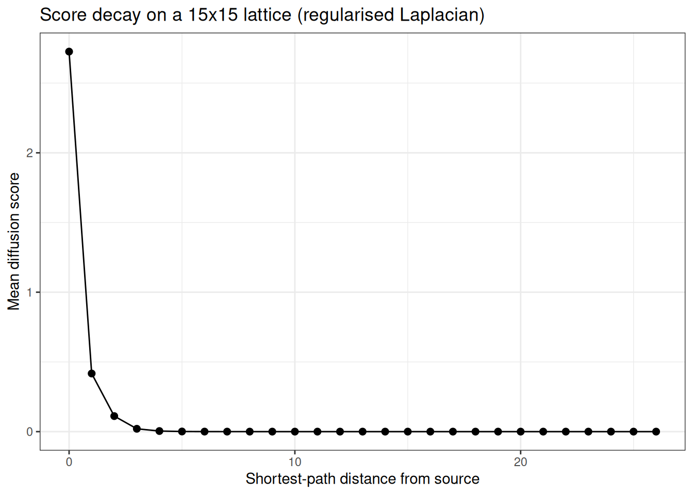
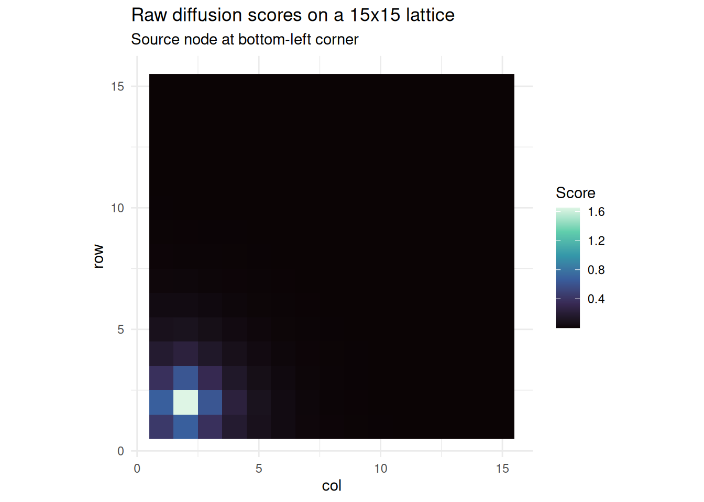
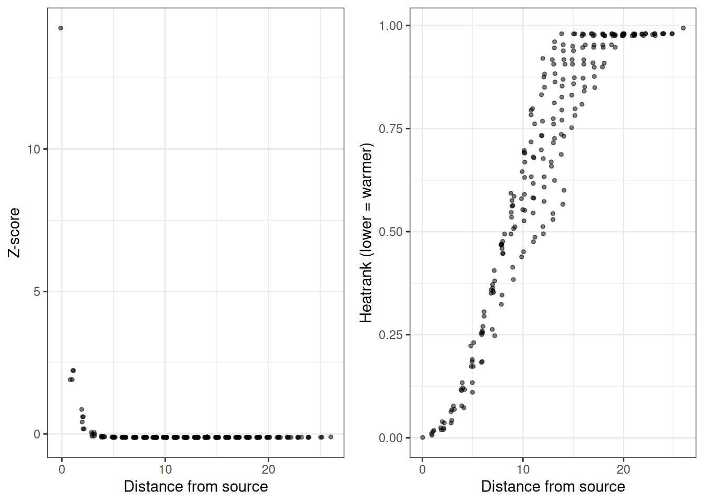
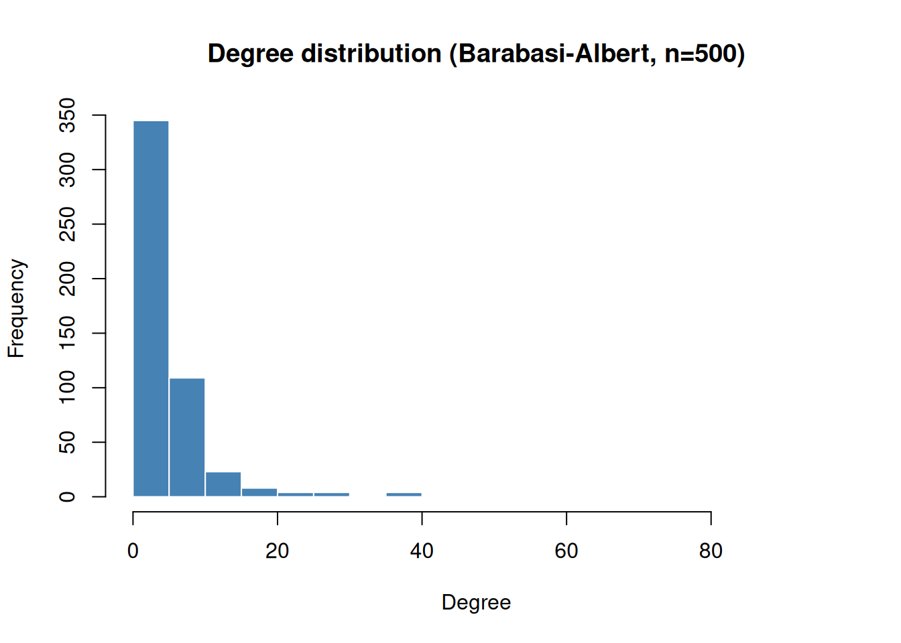
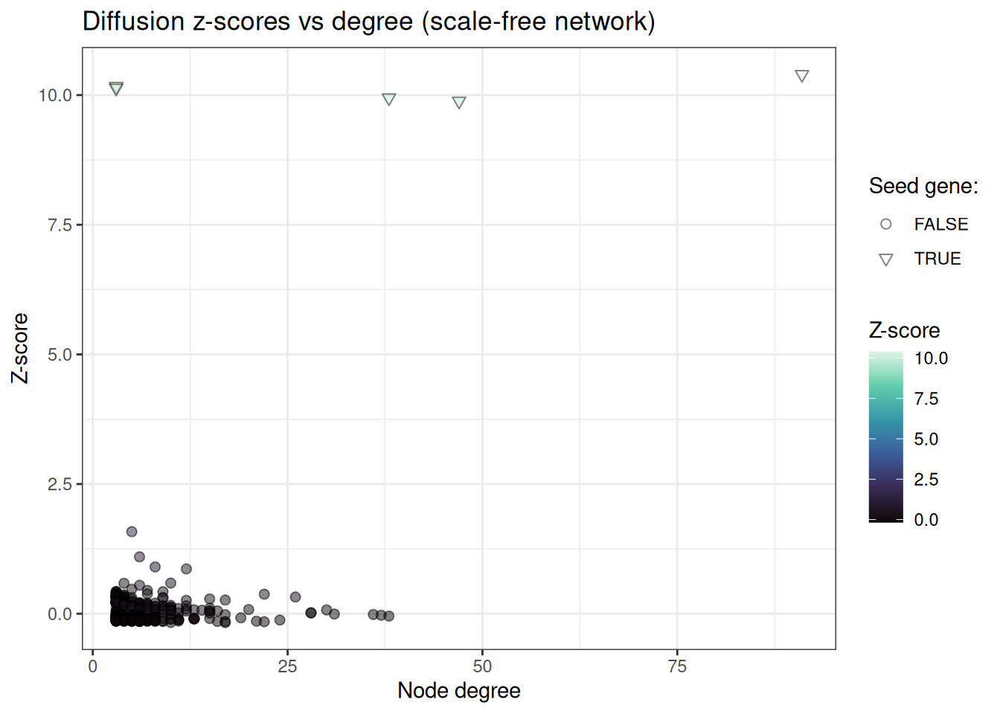
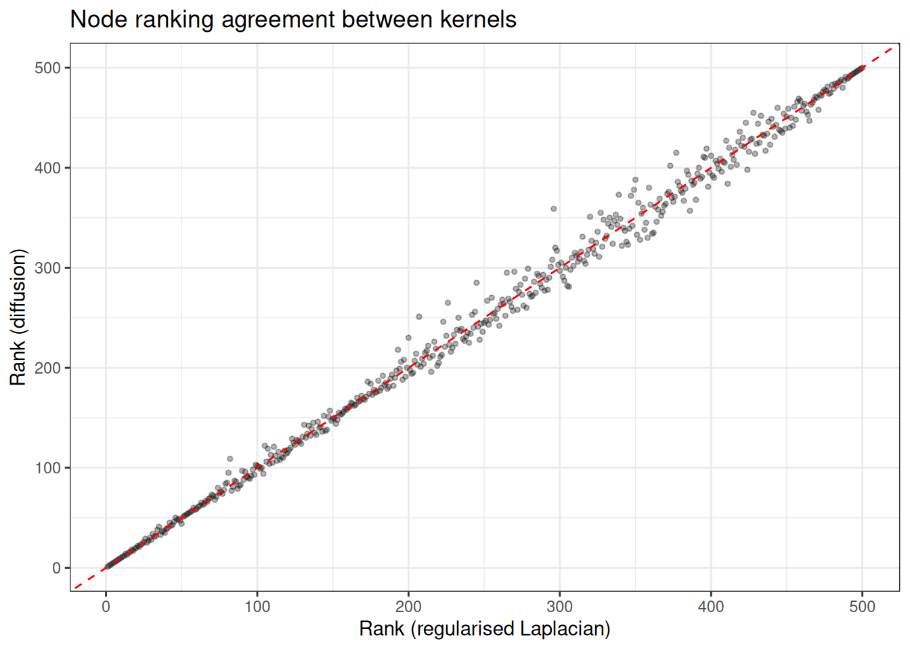

# Graph Diffusion

## Network diffusion with genewalkR

### Setup

``` r
library(genewalkR)
library(data.table)
library(igraph)
#> 
#> Attaching package: 'igraph'
#> The following objects are masked from 'package:stats':
#> 
#>     decompose, spectrum
#> The following object is masked from 'package:base':
#> 
#>     union
library(ggplot2)
```

### Background

Network diffusion propagates node-level signals (e.g. gene-level scores)
across a graph using a kernel derived from the graph Laplacian. The
intuition is straightforward: if a node carries a strong signal, its
neighbours should inherit some of that signal, with the strength
decaying as graph distance increases. This is useful for tasks based on
the “guilty by association” principle, where you have a handful of known
disease genes and want to find additional candidates that are
well-connected to them in a protein-protein interaction network.

`genewalkR` implements five spectral kernels from the diffusion
literature:

- **Regularised Laplacian**: \$(\\sigma^2 L + \\alpha I)^{-1}\$
- **Commute time**: Moore-Penrose pseudoinverse of $L$
- **Diffusion (heat)**: \$\\exp(-\\sigma^2 / 2 \\cdot L)\$
- **Inverse cosine**: \$\\cos(\\pi/4 \\cdot \\lambda)\$
- **p-step**: $(aI - L)^{p}$

And three scoring methods:

- **Raw**: direct kernel-weighted scores
- **Z-score**: analytically normalised scores under a permutation null
- **Monte Carlo (heatrank)**: empirical p-values via permutation testing

The entire computation is performed in Rust via a spectral decomposition
of the Laplacian, so the dense kernel matrix is never materialised. The
work here is based on the [diffuStats
package](https://pmc.ncbi.nlm.nih.gov/articles/PMC5860365/).

### A simple example: lattice graph

We start with a square lattice to build intuition. On a lattice, graph
distance is easy to reason about, so we can verify that diffusion scores
decay as expected.

#### Building the graph and kernel

``` r
# 15 x 15 lattice = 225 nodes
g <- make_lattice(dimvector = c(15, 15))
V(g)$name <- as.character(seq_len(vcount(g)))

obj <- DiffusionScores(g)
obj
#> DiffusionScores
#>   Graph: 225 nodes | 420 edges
#>   Kernel: not built
#>   Scores: not computed
```

Run the kernel:

``` r
obj <- build_kernel(
  obj,
  kernel = "regularised_laplacian",
  kernel_params = params_kernel(sigma2 = 1.0, add_diag = 1.0),
  normalised = TRUE,
  strategy = "full",
  .verbose = TRUE
)
obj
#> DiffusionScores
#>   Graph: 225 nodes | 420 edges
#>   Kernel: regularised_laplacian ( full )
#>   Normalised: TRUE 
#>   Scores: not computed
```

#### Diffusing a single source node

We place a unit signal on the corner node and diffuse it across the
network.

``` r
input_vec <- stats::setNames(5.0, "17")

obj <- diffuse_scores(obj, input = input_vec, method = "raw")
scores <- get_scores(obj)

head(scores[order(-input_1)])
#>      node   input_1
#>    <char>     <num>
#> 1:     17 2.7259920
#> 2:      2 0.4539191
#> 3:     16 0.4539191
#> 4:     18 0.3798274
#> 5:     32 0.3798274
#> 6:      1 0.1853117
```

#### Visualising score decay

On a lattice, we expect scores to decay monotonically with shortest-path
distance from the source.

``` r
dists <- distances(g, v = "17")
scores[, dist := as.integer(dists[1, node])]

decay_dt <- scores[, .(mean_score = mean(input_1)), by = dist]
setorder(decay_dt, dist)

ggplot(decay_dt, aes(x = dist, y = mean_score)) +
  geom_point(size = 2) +
  geom_line() +
  theme_bw() +
  labs(
    x = "Shortest-path distance from source",
    y = "Mean diffusion score",
    title = "Score decay on a 15x15 lattice (regularised Laplacian)"
  )
```



#### Heatmap on the grid

Since this is a square lattice, we can visualise the scores as a
heatmap.

``` r
scores[, row := (as.integer(node) - 1L) %/% 15L + 1L]
scores[, col := (as.integer(node) - 1L) %% 15L + 1L]

# square root the diffusion scores to make them nicer looking for plotting
# purposes
ggplot(scores, aes(x = col, y = row, fill = sqrt(input_1))) +
  geom_tile() +
  scale_fill_viridis_c(option = "mako") +
  coord_equal() +
  theme_minimal() +
  labs(
    fill = "Score",
    title = "Raw diffusion scores on a 15x15 lattice",
    subtitle = "Source node at bottom-left corner"
  )
```



We can see nicely how on this grid network the bottom left area of the
graph is getting the diffusion heat from the original source node.

#### Comparing scoring methods

We can compare the three scoring approaches on the same input:

``` r
all_nodes <- V(g)$name
input_full <- stats::setNames(
  ifelse(all_nodes == "17", 1.0, 0.0),
  all_nodes
)

# z-score
obj_z <- build_kernel(
  DiffusionScores(g),
  kernel = "regularised_laplacian",
  strategy = "full",
  .verbose = FALSE
)
obj_z <- diffuse_scores(obj_z, input = input_full, method = "z")
z_scores <- get_scores(obj_z)

# monte carlo heatrank
obj_mc <- build_kernel(
  DiffusionScores(g),
  kernel = "regularised_laplacian",
  strategy = "full",
  .verbose = FALSE
)
obj_mc <- diffuse_scores(
  obj_mc,
  input = input_full,
  method = "mc",
  n_perm = 1000L,
  seed = 42L
)
mc_scores <- get_scores(obj_mc)

# combine
comparison <- merge(
  scores[, .(node, raw = input_1, dist)],
  z_scores[, .(node, z = input_1)],
  by = "node"
)
comparison <- merge(
  comparison,
  mc_scores[, .(node, heatrank = input_1)],
  by = "node"
)

head(comparison[order(-raw)])
#>      node       raw  dist          z    heatrank
#>    <char>     <num> <int>      <num>       <num>
#> 1:     17 2.7259920     0 14.2439760 0.000999001
#> 2:      2 0.4539191     1  2.2255302 0.017982018
#> 3:     16 0.4539191     1  2.2255302 0.014985015
#> 4:     18 0.3798274     1  1.9086571 0.009990010
#> 5:     32 0.3798274     1  1.9086571 0.005994006
#> 6:      1 0.1853117     2  0.8621933 0.019980020
```

``` r
p1 <- ggplot(comparison, aes(x = dist, y = z)) +
  geom_jitter(width = 0.2, alpha = 0.5, size = 1) +
  theme_bw() +
  labs(x = "Distance from source", y = "Z-score")

p2 <- ggplot(comparison, aes(x = dist, y = heatrank)) +
  geom_jitter(width = 0.2, alpha = 0.5, size = 1) +
  theme_bw() +
  labs(x = "Distance from source", y = "Heatrank (lower = warmer)")

gridExtra::grid.arrange(p1, p2, ncol = 2)
```



### Biologically motivated example: scale-free network

Real biological networks (PPI, gene regulatory) tend to be scale-free:
most nodes have few connections, but a small number of hubs are highly
connected. We can simulate this with a Barabasi-Albert preferential
attachment model.

#### Generating the network

We will generate a random network first…

``` r
set.seed(42)
g_sf <- sample_pa(n = 500, m = 3, directed = FALSE)
V(g_sf)$name <- paste0("gene_", seq_len(vcount(g_sf)))

# degree distribution
deg <- degree(g_sf)
hist(
  deg,
  breaks = 30,
  main = "Degree distribution (Barabasi-Albert, n=500)",
  xlab = "Degree",
  col = "steelblue",
  border = "white"
)
```



We can appreciate that most nodes have very few connections, with some
having the majority of edges in the network.

#### Simulating a disease gene signal

We pick a handful of “seed genes” (mimicking known disease associations
or gene function) and diffuse their signal across the network to
prioritise candidate genes.

``` r
# pick 5 seed genes: a mix of hubs and peripheral nodes
seed_genes <- c(
  names(sort(deg, decreasing = TRUE))[1:3], # top 3 hubs
  sample(names(deg[deg <= 3]), 2) # 2 peripheral nodes
)
cat("Seed genes:", paste(seed_genes, collapse = ", "), "\n")
#> Seed genes: gene_5, gene_1, gene_4, gene_249, gene_472
cat("Seed degrees:", deg[seed_genes], "\n")
#> Seed degrees: 91 47 38 3 3
```

#### Running diffusion

``` r
obj_sf <- DiffusionScores(g_sf)

obj_sf <- build_kernel(
  obj_sf,
  kernel = "regularised_laplacian",
  kernel_params = params_kernel(sigma2 = 1.0, add_diag = 1.0),
  normalised = TRUE,
  strategy = "full",
  .verbose = TRUE
)

# input: seed genes get score 1, rest is background
all_genes <- V(g_sf)$name
input_sf <- stats::setNames(
  ifelse(all_genes %in% seed_genes, 1.0, 0.0),
  all_genes
)

obj_sf <- diffuse_scores(obj_sf, input = input_sf, method = "z")
results <- get_scores(obj_sf)
setorder(results, -input_1)

head(results, 20)
#>         node    input_1
#>       <char>      <num>
#>  1:   gene_5 10.3986239
#>  2: gene_472 10.1696624
#>  3: gene_249 10.1351093
#>  4:   gene_4  9.9473892
#>  5:   gene_1  9.8849507
#>  6: gene_236  1.5813897
#>  7: gene_211  1.0957907
#>  8: gene_230  0.9027809
#>  9:  gene_69  0.8638611
#> 10:  gene_28  0.5907598
#> 11: gene_279  0.5877281
#> 12: gene_197  0.5488474
#> 13: gene_183  0.4741730
#> 14: gene_368  0.4495234
#> 15: gene_345  0.4313139
#> 16:  gene_29  0.4235714
#> 17: gene_168  0.4218336
#> 18: gene_305  0.4056889
#> 19: gene_358  0.3872085
#> 20: gene_290  0.3863111
#>         node    input_1
#>       <char>      <num>
```

We can clearly appreciate that our seed genes have the most heat,
followed by the neighbours.

#### Inspecting the top candidates

We can also investigate the top candidates that are not seed genes

``` r
results[, is_seed := node %in% seed_genes]
results[, rank := .I]
results[, degree := deg[node]]

# top 20 non-seed genes
top_candidates <- results[!(is_seed)][1:20]
top_candidates[, .(node, z_score = round(input_1, 3), degree)]
#>         node z_score degree
#>       <char>   <num>  <num>
#>  1: gene_236   1.581      5
#>  2: gene_211   1.096      6
#>  3: gene_230   0.903      8
#>  4:  gene_69   0.864     12
#>  5:  gene_28   0.591     10
#>  6: gene_279   0.588      4
#>  7: gene_197   0.549      6
#>  8: gene_183   0.474      5
#>  9: gene_368   0.450      7
#> 10: gene_345   0.431      3
#> 11:  gene_29   0.424      9
#> 12: gene_168   0.422      3
#> 13: gene_305   0.406      3
#> 14: gene_358   0.387      3
#> 15: gene_290   0.386      3
#> 16: gene_362   0.385      3
#> 17:  gene_13   0.381      7
#> 18:   gene_7   0.376     22
#> 19: gene_317   0.365      4
#> 20: gene_500   0.365      3
#>         node z_score degree
#>       <char>   <num>  <num>
```

And explore the relationship of node degree with resulting Z-scores:

``` r
ggplot(results, aes(x = degree, y = input_1, fill = input_1, shape = is_seed)) +
  geom_point(alpha = 0.5, size = 2) +
  scale_fill_viridis_c(option = "mako") +
  scale_shape_manual(values = setNames(c(25, 21), c(TRUE, FALSE))) +
  theme_bw() +
  labs(
    x = "Node degree",
    y = "Z-score",
    fill = "Z-score",
    shape = "Seed gene:",
    title = "Diffusion z-scores vs degree (scale-free network)"
  )
```



#### Comparing kernels

Different kernels emphasise different aspects of the network topology.
The diffusion kernel with a large bandwidth spreads signal more broadly,
whilst the regularised Laplacian is more conservative. For this
synthetic example however, we only tiny difference s

``` r
kernels <- c("regularised_laplacian", "diffusion", "pstep")
kernel_results <- list()

for (kt in kernels) {
  kp <- switch(
    kt,
    "diffusion" = params_kernel(sigma2 = 2.0),
    "pstep" = params_kernel(a = 3.0, p = 5L),
    params_kernel()
  )

  tmp <- build_kernel(
    DiffusionScores(g_sf),
    kernel = kt,
    kernel_params = kp,
    normalised = TRUE,
    strategy = "full",
    .verbose = FALSE
  )
  tmp <- diffuse_scores(tmp, input = input_sf, method = "raw")
  sc <- get_scores(tmp)
  sc[, kernel := kt]
  kernel_results[[kt]] <- sc
}

combined <- rbindlist(kernel_results)
combined[, is_seed := node %in% seed_genes]

# rank within each kernel
combined[, rank := frank(-input_1), by = kernel]

# overlap in top 20 across kernels
top_sets <- combined[
  rank <= 20 & is_seed == FALSE,
  .(genes = list(node)),
  by = kernel
]
cat("Top 20 non-seed genes per kernel:\n")
#> Top 20 non-seed genes per kernel:
for (i in seq_len(nrow(top_sets))) {
  cat(sprintf(
    "  %s: %s\n",
    top_sets$kernel[i],
    paste(top_sets$genes[[i]], collapse = ", ")
  ))
}
#>   regularised_laplacian: gene_3, gene_7, gene_13, gene_28, gene_29, gene_69, gene_168, gene_183, gene_197, gene_211, gene_230, gene_236, gene_279, gene_345, gene_368
#>   diffusion: gene_3, gene_7, gene_13, gene_28, gene_29, gene_69, gene_168, gene_183, gene_197, gene_211, gene_230, gene_236, gene_279, gene_345, gene_368
#>   pstep: gene_3, gene_7, gene_28, gene_29, gene_69, gene_129, gene_168, gene_183, gene_197, gene_211, gene_230, gene_236, gene_279, gene_345, gene_368
```

``` r
# compare ranks across kernels
rank_wide <- dcast(
  combined[, .(node, kernel, rank)],
  node ~ kernel,
  value.var = "rank"
)

ggplot(rank_wide, aes(x = regularised_laplacian, y = diffusion)) +
  geom_point(alpha = 0.3, size = 1) +
  geom_abline(slope = 1, intercept = 0, linetype = "dashed", colour = "red") +
  theme_bw() +
  labs(
    x = "Rank (regularised Laplacian)",
    y = "Rank (diffusion)",
    title = "Node ranking agreement between kernels"
  )
```



### Summary

The `DiffusionScores` workflow separates kernel construction from
scoring, so you can build the kernel once and run multiple diffusions
with different inputs or methods without recomputing the spectral
decomposition. For large networks (\> 2000 nodes), the truncated
strategy avoids the dense eigenvalue decomposition entirely, using an
iterative Lanczos solver that scales to networks with tens of thousands
of nodes.
